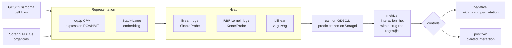
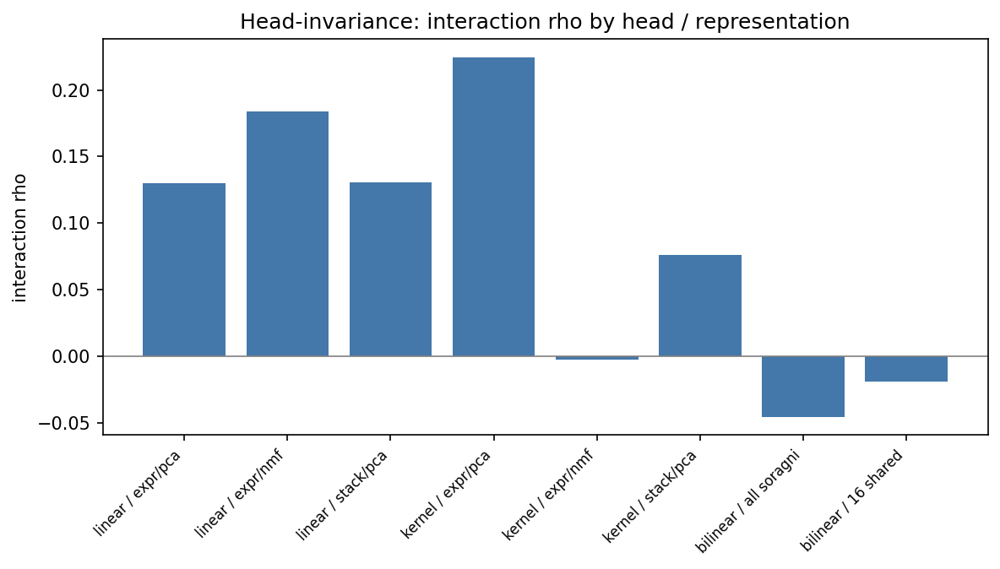

# fm-pdo-evaluator

Foundation-model evaluation harness for patient-derived tumor organoid (PDTO) drug-response prediction. Realizing the benefits of foundation models requires careful evaluations that map the boundaries of generalization.

The harness trains a fixed downstream head on cell-line drug screens (GDSC2) and tests it, frozen, on sarcoma organoids (Soragni 2024), comparing foundation-model embeddings (Stack) against simple expression baselines under negative and positive controls. It is the companion code for *Prospective Evaluation of Foundation Model Performance in Precision Medicine* (greenelab/fm-pm-eval-manuscript).

## Quickstart

```bash
# Install uv (Python package manager) if you don't already have it
curl -LsSf https://astral.sh/uv/install.sh | sh

# Sync dependencies (creates .venv and uv.lock)
uv sync --extra dev

# Run the tests
uv run pytest
```

## Evaluation design

A model is scored as a **representation** (PCA/NMF of expression, or a Stack embedding) fed to a swappable **head** (linear ridge or RBF kernel ridge). The head is trained on GDSC2 cell lines and frozen, then asked to predict held-out Soragni organoids. Negative (within-drug permutation) and positive (planted interaction) controls bracket every result. See [docs/models.md](docs/models.md) for each model and [docs/adapter_contract.md](docs/adapter_contract.md) for the encoder interface.



## Datasets

- **Soragni 2024** sarcoma PDTOs ([Synapse PDTOSarcoma](https://www.synapse.org/PDTOSarcoma)) — 17 matched organoids, 21 drugs shared with GDSC2 by PubChem CID
- **GDSC2** sarcoma cell lines (DepMap RNA-seq + GDSC2 screen) — 28 lines, the powered training cohort
- **Yang 2024** primary liver cancer PDOs ([Cancer Cell](https://www.cell.com/cancer-cell/fulltext/S1535-6108(24)00089-8)) — deferred to v2

The cohorts and the shared drug panel (the raw inputs, no model):


Regenerate with `uv run python scripts/plot_data.py`.

## Results

**A Stack-Large embedding gives no advantage over PCA of expression for sarcoma drug response.** In-distribution (within GDSC2 sarcoma), the embedding signal beyond the drug mean is, if anything, weaker than expression PCA (interaction rho: expression 0.224 > Stack 0.199 > subtype 0.138). Out of distribution (GDSC2 → Soragni, frozen), the transcriptome models collapse toward the drug-mean prior, and the predictive signal lives in the functional organoid screens rather than the transcriptome. Positive controls confirm each apparatus has full power when signal is planted in its own representation, so the null is biological, not a dead pipeline.

### Head-invariance

The headline comparison rides on a *linear* head, so the obvious objection is that a foundation-model embedding might only pay off under a *nonlinear* head. Running the same frozen GDSC2 → Soragni transfer through linear ridge, RBF kernel ridge, and the bilinear model shows the result holds across head families — the nonlinear head does **not** rescue Stack:

| head | representation | interaction rho | p |
|---|---|--:|--:|
| linear | expression PCA | +0.130 | 0.105 |
| linear | expression NMF | +0.184 | 0.035 |
| linear | Stack | +0.130 | 0.085 |
| kernel | expression PCA | **+0.225** | 0.005 |
| kernel | Stack | +0.076 | 0.225 |
| bilinear | 16 shared drugs | −0.019 | 0.420 |

Under the linear head expression and Stack tie; under the kernel head **expression rises to 0.225 while Stack stays at 0.076** — the nonlinear capacity benefits expression, not the embedding. Stack ≤ expression is head-invariant.



Regenerate the table and figure:

```bash
uv run python scripts/transfer_gdsc_soragni.py --all-heads \
    --stack-gdsc stack_gdsc.csv --stack-soragni stack_soragni.csv \
    --out results/head_invariance.csv
uv run python scripts/transfer_pharmaformer_lite.py --out results/head_invariance.csv
uv run python scripts/plot_data.py
```

## Affiliation

Greene Laboratory, University of Colorado Anschutz Medical Campus.

## License

BSD-2-Clause Plus Patent License (see [LICENSE](LICENSE)).
