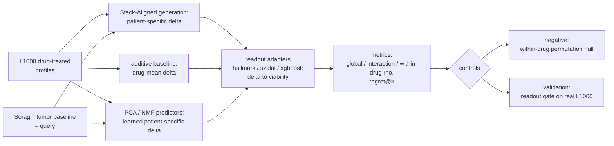
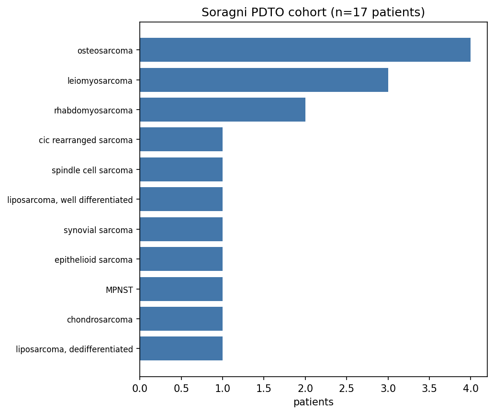
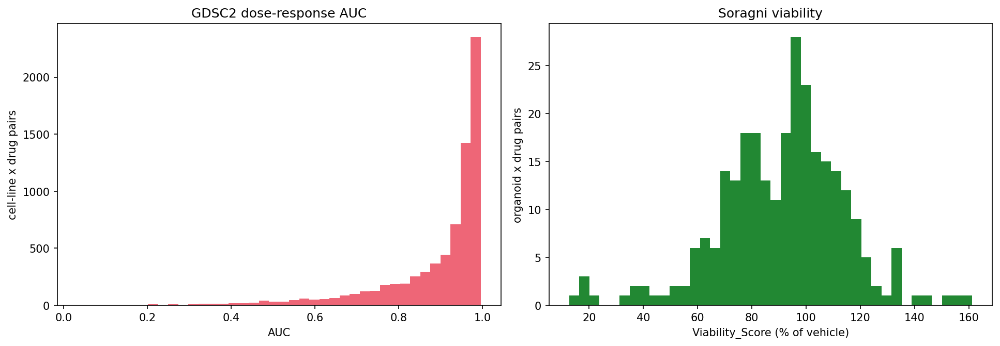
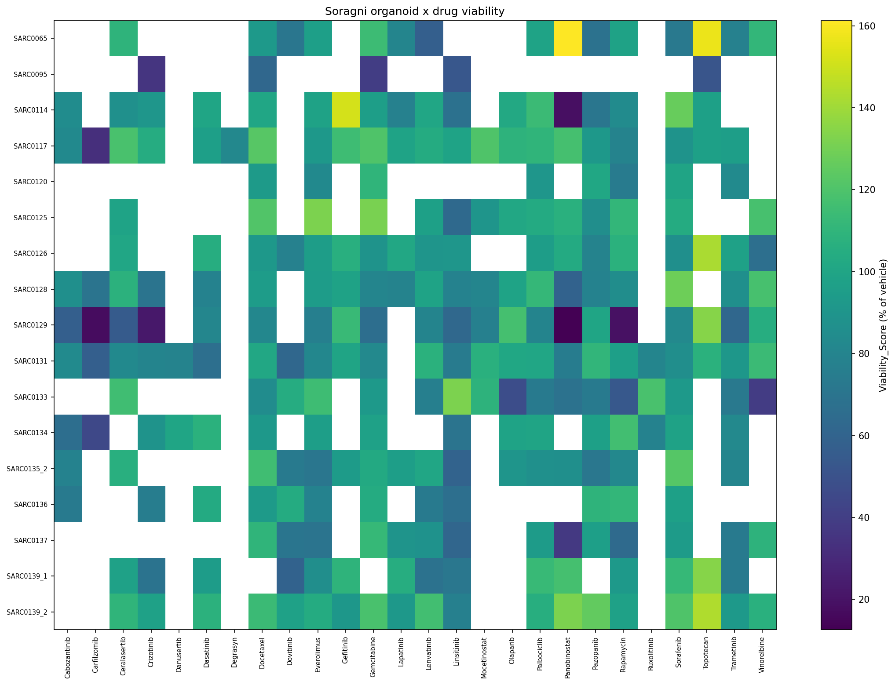
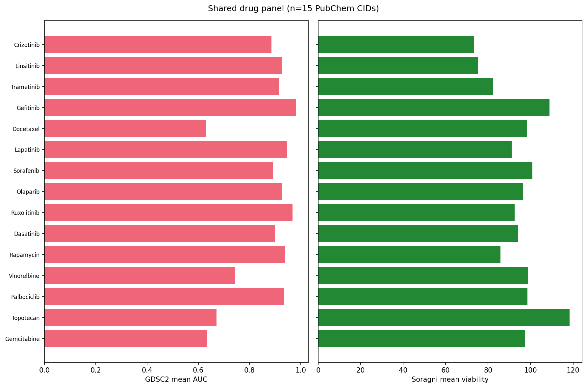

# fm-pdo-evaluator

Foundation-model evaluation harness for patient-derived tumor organoid (PDTO) drug-response prediction. Realizing the benefits of foundation models requires careful evaluations that map the boundaries of generalization — and that test a model in the mode it was actually designed for.

This harness evaluates the Stack single-cell foundation model in its native **prompt→query** mode: given a context of drug-treated cells (the prompt) and a patient's **tumor** transcriptome (the query), Stack-Aligned generates that patient's drug-treated state, which a transcriptional readout turns into a viability prediction. The input is the patient tumor RNA and the label is the matched **organoid** drug screen — the clinically realistic cross-substrate task, not the easy matched-organoid-RNA one. Crucially, that readout is applied to **every delta source on equal footing**, so Stack's generated response is compared head-to-head against a simple non-foundation-model baseline rather than scored in isolation. Companion code for *Prospective Evaluation of Foundation Model Performance in Precision Medicine* (greenelab/fm-pm-eval-manuscript).

## Quickstart

```bash
# Install uv (Python package manager) if you don't already have it
curl -LsSf https://astral.sh/uv/install.sh | sh

# Sync dependencies (creates .venv and uv.lock)
uv sync --extra dev

# Run the tests
uv run pytest
```

## Evaluation design

The prediction target is Soragni sarcoma organoid drug response (viability), predicted from the patient **tumor** transcriptome. Stack is run in its generative in-context mode: a perturbation context of drug-treated cells plus the patient tumor baseline → a predicted treated transcriptome → a viability readout. Because that context needs drug-*treated* transcriptomes, **L1000** (LINCS) is the perturbation source — cell-line drug screens like GDSC2 have only baseline expression and a scalar AUC, so they cannot form the prompt; GDSC2 instead supplies the viability labels that train the supervised readouts.

The fairness principle: the readout adapters are applied to **every** delta source, not only Stack's. The non-foundation-model baselines span the spectrum of patient specificity — an **additive baseline** (each drug's mean real L1000 delta, applied to every patient; no patient×drug interaction by construction) and **PCA/NMF learned predictors** (a linear baseline→delta map fit on real L1000, giving a patient-specific correction). Stack only earns its keep if its generated delta beats these on the same readouts and metrics.



See [docs/models.md](docs/models.md) for each model and [docs/adapter_contract.md](docs/adapter_contract.md) for the model interface.

### Data transformations

- **Expression → per-million.** GDSC2 (DepMap raw RSEM counts → pydeseq2 median-of-ratios in the loader, raw counts retained) and Soragni (deposited per-million matrix, Synapse `syn64333318`) are both put on one length-free counts-per-million scale by `cpm_bundle` ([src/fmharness/evaluation.py](src/fmharness/evaluation.py)). This matters because Stack is a count model; the earlier CoderData layer mixed TPM and CPM across cohorts, which confounds it.
- **Stack input.** Each sample's per-million expression over a fixed ~12.8k-gene high-variance panel (`data/static/stack_hvg_genes.txt`, mapped via `stack_soragni_gene_map.csv`) is sent to Stack as a pseudo-cell; Stack applies `log1p` + a negative-binomial decoder internally.
- **Deltas.** A treated−control difference is taken in log-CPM (`logcpm`), so it is a log fold-change rather than a depth-dominated count difference. Real L1000 deltas are treated minus DMSO group means; the additive baseline is each drug's mean over those; Stack's delta is generated-treated minus the patient tumor baseline. All builders live in [src/fmharness/l1000.py](src/fmharness/l1000.py).

### Models

| Layer | Options |
|---|---|
| **Delta source** (predict the treated transcriptome) | Stack-Aligned generation (patient-specific); PCA/NMF learned predictors (patient-specific, linear baseline→delta map on L1000); additive drug-mean baseline (patient-independent floor) |
| **Readout adapter** (delta → viability) | `hallmark` (unsupervised death/proliferation signature), `szalai` (L2 linear), `xgboost` (elastic-net selection + boosted trees) — supervised readouts fit on real L1000 deltas vs GDSC2 AUC |
| **Metrics** | global / within-drug / interaction Spearman; normalized regret@k; within-drug permutation null |

Every model implements one `ModelAdapter` ([src/fmharness/models/adapter.py](src/fmharness/models/adapter.py)) so splits, metrics, and controls stay model-agnostic. Operational detail per model is in [docs/models.md](docs/models.md).

## Datasets

- **Soragni 2024** sarcoma PDTOs ([Synapse PDTOSarcoma](https://www.synapse.org/PDTOSarcoma)) — 17 matched patients; the **tumor** transcriptome is the model input (query) and the matched **organoid** drug screen is the viability ground truth
- **L1000** (LINCS GSE92742) — drug-treated + DMSO bulk profiles; the perturbation context (prompt) and the readout-validation cohort
- **GDSC2** sarcoma cell lines (DepMap RNA-seq + GDSC2 screen) — the viability labels that train the supervised readouts

The cohorts and the shared drug panel (the raw inputs, no model):






Regenerate with `uv run python scripts/plot_data.py`.

## Results

Every (delta source × readout adapter) cell is scored against the real Soragni viability with the same global / within-drug / interaction rho and normalized regret@k, bracketed by controls:

- **Negative — within-drug permutation.** Shuffle the response within each drug; any patient×drug interaction signal must vanish.
- **Validation — readout gate.** Each readout is scored on *real* L1000 deltas to confirm it can detect a true drug effect (the gate: ≈0.143 vs a random-gene-set ≈0.065), so a null on generated deltas reflects the generation, not a dead readout.

The headline question is whether Stack's patient-specific generated delta beats the simple baselines — the additive drug-mean floor and the PCA/NMF learned predictors — under any readout, on interaction and on the clinical regret@k. An earlier Stack-only run of this path was null (apoptosis ≈0.12 vs random p95 ≈0.13–0.14, robust to normalization), attributed to the domain gap (bulk tumor samples as pseudo-cells, off Stack's single-cell depth distribution) and a thin, looped context. The fair source×readout grid — additive, PCA, NMF, and Stack across all readouts — is implemented; **producing the numbers requires an Alpine run** with the L1000 `.gctx` and the Stack generation step (GPU). Results will be reported here once that run completes.

```bash
# build the L1000 perturbation context, generate (GPU), then score every source x readout:
uv run python scripts/build_l1000_context.py --l1000-dir . --gctx <level3>.gctx --out l1000_context.h5ad
# stack-generation ... --base-adata l1000_context.h5ad --test-adata stack_input_sarcoma.h5ad --output-dir generated/
uv run python scripts/score_viability_adapters.py --l1000-dir . --gctx <level3>.gctx --generated-dir generated/
```

## Affiliation

Greene Laboratory, University of Colorado Anschutz Medical Campus.

## License

BSD-2-Clause Plus Patent License (see [LICENSE](LICENSE)).
